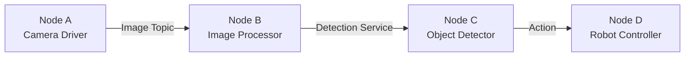
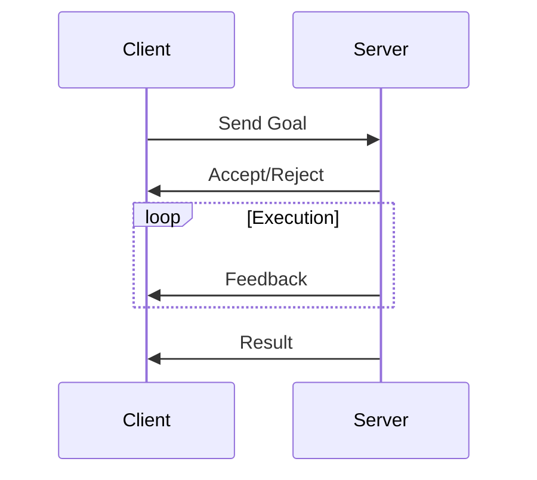
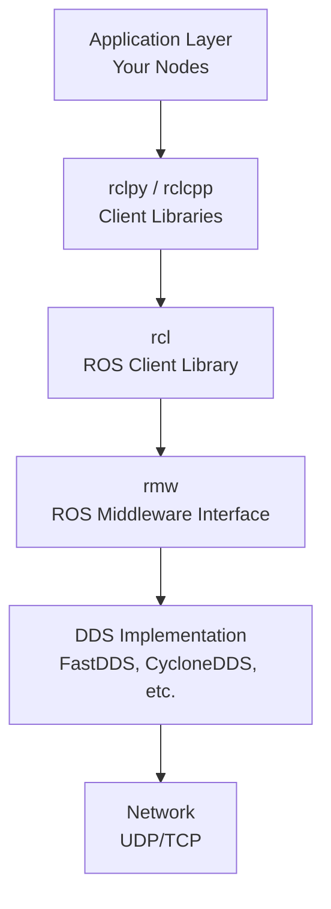

# Chapter 1: What is ROS 2?

## Introduction

**ROS 2 (Robot Operating System 2)** is the next generation of the world's most popular robot middleware framework. Despite its name, ROS is not an operating system but rather a flexible framework for writing robot software - a collection of tools, libraries, and conventions that aim to simplify the task of creating complex and robust robot behavior across a wide variety of robotic platforms.

## What Makes ROS 2 Different?

### Evolution from ROS 1

ROS 2 is a complete redesign of ROS 1, addressing critical limitations:

| Feature | ROS 1 | ROS 2 |
|---------|-------|-------|
| Communication | Custom TCPROS | DDS (Data Distribution Service) |
| Real-time Support | Limited | Native support |
| Multi-robot | Difficult | Built-in |
| Security | Basic | Encrypted, authenticated |
| Platform Support | Linux only | Linux, Windows, macOS |
| Production Ready | Research-focused | Production-grade |

### Key Improvements

1. **Real-time Performance**: Built-in support for real-time systems
2. **Security**: Encryption and authentication at the transport layer
3. **Cross-platform**: Native support for Linux, Windows, and macOS
4. **Multi-robot**: First-class support for multi-robot systems
5. **Commercial Quality**: Production-ready with quality-of-service (QoS) policies

## Core Concepts

### 1. Nodes

A **node** is a process that performs computation. Nodes communicate with each other using:



### 2. Topics (Publish/Subscribe)

Topics enable asynchronous, many-to-many communication:

```python
# Publisher example
import rclpy
from rclpy.node import Node
from std_msgs.msg import String

class MinimalPublisher(Node):
    def __init__(self):
        super().__init__('minimal_publisher')
        self.publisher_ = self.create_publisher(String, 'topic', 10)
        timer_period = 0.5  # seconds
        self.timer = self.create_timer(timer_period, self.timer_callback)

    def timer_callback(self):
        msg = String()
        msg.data = 'Hello ROS 2!'
        self.publisher_.publish(msg)
        self.get_logger().info(f'Publishing: "{msg.data}"')
```

### 3. Services (Request/Response)

Services provide synchronous request/response communication:

```python
# Service server example
from example_interfaces.srv import AddTwoInts

class MinimalService(Node):
    def __init__(self):
        super().__init__('minimal_service')
        self.srv = self.create_service(
            AddTwoInts,
            'add_two_ints',
            self.add_two_ints_callback
        )

    def add_two_ints_callback(self, request, response):
        response.sum = request.a + request.b
        self.get_logger().info(f'{request.a} + {request.b} = {response.sum}')
        return response
```

### 4. Actions (Goal-oriented Tasks)

Actions enable long-running tasks with feedback:



## DDS: The Communication Backbone

ROS 2 uses **DDS (Data Distribution Service)** for communication:

### Benefits of DDS:

- **Quality of Service (QoS)**: Configure reliability, durability, latency
- **Discovery**: Automatic node discovery without master
- **Scalability**: Efficient for large-scale systems
- **Interoperability**: Standard protocol (OMG DDS)

### QoS Policies Example:

```python
from rclpy.qos import QoSProfile, ReliabilityPolicy, DurabilityPolicy

# Sensor data: best effort, volatile
sensor_qos = QoSProfile(
    reliability=ReliabilityPolicy.BEST_EFFORT,
    durability=DurabilityPolicy.VOLATILE,
    depth=10
)

# Commands: reliable, transient local
command_qos = QoSProfile(
    reliability=ReliabilityPolicy.RELIABLE,
    durability=DurabilityPolicy.TRANSIENT_LOCAL,
    depth=10
)
```

## ROS 2 Architecture



## When to Use ROS 2

### Perfect For:
- ✅ Research robots
- ✅ Commercial products (manufacturing, logistics, agriculture)
- ✅ Autonomous vehicles
- ✅ Drones and UAVs
- ✅ Humanoid robots
- ✅ Service robots

### Not Ideal For:
- ❌ Bare-metal microcontrollers (use micro-ROS instead)
- ❌ Hard real-time &lt;1ms requirements
- ❌ Simple single-board projects (might be overkill)

## Supported Platforms

| Platform | Tier 1 Support | Tier 2 Support |
|----------|----------------|----------------|
| **Ubuntu 22.04** | ✅ | - |
| **Ubuntu 24.04** | ✅ | - |
| **Windows 10/11** | - | ✅ |
| **macOS** | - | ✅ |
| **RHEL** | - | ✅ |

## ROS 2 Distributions

ROS 2 follows a release cycle with LTS (Long-Term Support) versions:

| Distribution | Release Date | EOL | Type |
|--------------|--------------|-----|------|
| **Humble Hawksbill** | May 2022 | May 2027 | LTS ✅ |
| **Iron Irwini** | May 2023 | Nov 2024 | Standard |
| **Jazzy Jalisco** | May 2024 | May 2029 | LTS ✅ |

**Recommendation**: Use **Humble** (stable, well-tested) or **Jazzy** (latest features).

## Real-World Applications

### 1. Autonomous Vehicles
- Waymo, Cruise, Zoox use ROS-based stacks
- Sensor fusion, perception, planning, control

### 2. Industrial Robots
- BMW uses ROS 2 for production lines
- Collaborative robots (cobots)

### 3. Service Robots
- Hospital delivery robots
- Cleaning robots
- Warehouse automation

### 4. Research
- Universities worldwide
- Benchmark platform for robotics research

## Summary

ROS 2 is the industry-standard framework for modern robotics:

- 🚀 **Production-ready** with real-time support
- 🔒 **Secure** with built-in encryption
- 🌍 **Cross-platform** (Linux, Windows, macOS)
- 🤖 **Multi-robot** systems out of the box
- 📦 **Ecosystem** of 3000+ packages

## Exercise

1. **Research**: Find 3 companies using ROS 2 in production
2. **Comparison**: List 5 differences between ROS 1 and ROS 2
3. **Use Case**: Identify a robot application where ROS 2 would be beneficial

## Next Chapter

In [Chapter 2](/docs/module1-ros2/chapter2-installation-setup), we'll set up your ROS 2 development environment and create your first node!

## Additional Resources

- [ROS 2 Documentation](https://docs.ros.org/en/humble/)
- [Design Articles](https://design.ros2.org/)
- [ROS Discourse](https://discourse.ros.org/)
