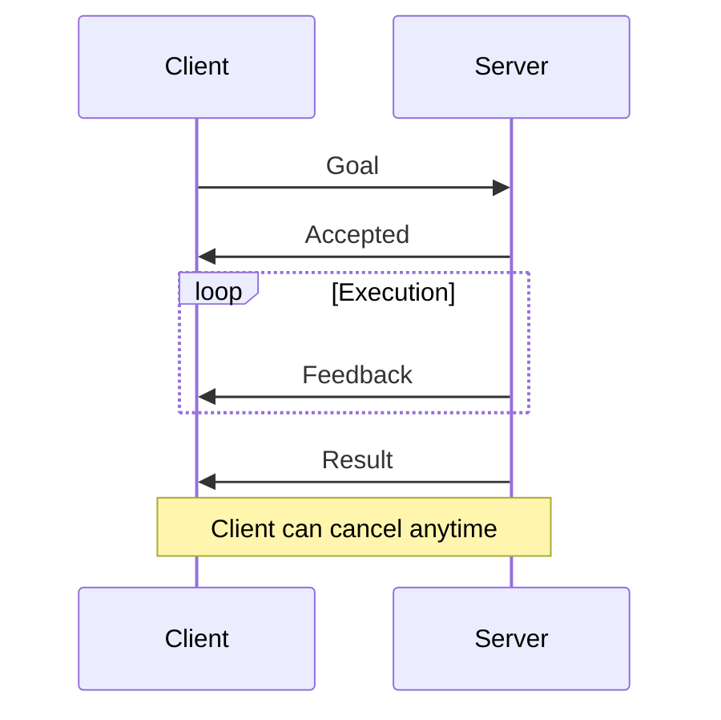
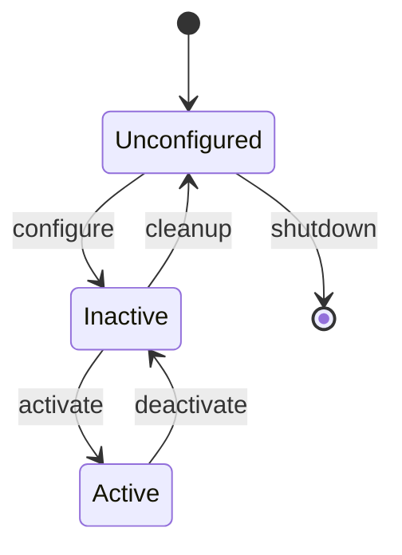

# Chapter 3: ROS 2 Core Concepts

## Introduction

Understanding ROS 2's core concepts is essential for building robust robot applications. This chapter covers the fundamental building blocks: nodes, topics, services, actions, and parameters.

## 1. Nodes: The Building Blocks

A **node** is an executable that uses ROS to communicate with other nodes. Nodes should perform a single, well-defined task.

### Node Design Principles


**Best Practices**:
- ✅ One node = one responsibility
- ✅ Nodes should be reusable
- ✅ Use namespaces for organization
- ✅ Handle shutdown gracefully

### Creating a Node (Python)

```python
import rclpy
from rclpy.node import Node

class MyNode(Node):
    def __init__(self):
        super().__init__('my_node')
        self.get_logger().info('Node started!')

        # Create timer (10Hz)
        self.timer = self.create_timer(0.1, self.timer_callback)

    def timer_callback(self):
        self.get_logger().info('Timer callback')

def main(args=None):
    rclpy.init(args=args)
    node = MyNode()
    rclpy.spin(node)
    node.destroy_node()
    rclpy.shutdown()

if __name__ == '__main__':
    main()
```

### Creating a Node (C++)

```cpp
#include "rclcpp/rclcpp.hpp"

class MyNode : public rclcpp::Node
{
public:
    MyNode() : Node("my_node")
    {
        RCLCPP_INFO(this->get_logger(), "Node started!");

        // Create timer (10Hz)
        timer_ = this->create_wall_timer(
            std::chrono::milliseconds(100),
            std::bind(&MyNode::timerCallback, this));
    }

private:
    void timerCallback()
    {
        RCLCPP_INFO(this->get_logger(), "Timer callback");
    }

    rclcpp::TimerBase::SharedPtr timer_;
};

int main(int argc, char * argv[])
{
    rclcpp::init(argc, argv);
    rclcpp::spin(std::make_shared<MyNode>());
    rclcpp::shutdown();
    return 0;
}
```

## 2. Topics: Publish/Subscribe Communication

Topics enable **asynchronous**, **many-to-many** communication.

### Topic Characteristics

| Feature | Description |
|---------|-------------|
| **Asynchronous** | Non-blocking communication |
| **Decoupled** | Publishers/subscribers don't know each other |
| **Many-to-Many** | Multiple pubs/subs on same topic |
| **Typed** | Messages have defined types |

### Publisher Example

```python
from std_msgs.msg import String

class PublisherNode(Node):
    def __init__(self):
        super().__init__('publisher')
        self.pub = self.create_publisher(String, 'topic', 10)
        self.timer = self.create_timer(1.0, self.publish_message)

    def publish_message(self):
        msg = String()
        msg.data = f'Hello {self.get_clock().now()}'
        self.pub.publish(msg)
        self.get_logger().info(f'Published: {msg.data}')
```

### Subscriber Example

```python
class SubscriberNode(Node):
    def __init__(self):
        super().__init__('subscriber')
        self.sub = self.create_subscription(
            String,
            'topic',
            self.callback,
            10
        )

    def callback(self, msg):
        self.get_logger().info(f'Received: {msg.data}')
```

### Quality of Service (QoS)

```python
from rclpy.qos import QoSProfile, ReliabilityPolicy, HistoryPolicy

# Reliable delivery with history
reliable_qos = QoSProfile(
    reliability=ReliabilityPolicy.RELIABLE,
    history=HistoryPolicy.KEEP_LAST,
    depth=10
)

# Best effort for sensor data
sensor_qos = QoSProfile(
    reliability=ReliabilityPolicy.BEST_EFFORT,
    history=HistoryPolicy.KEEP_LAST,
    depth=1
)

pub = self.create_publisher(String, 'topic', reliable_qos)
```

## 3. Services: Request/Response

Services provide **synchronous** communication for request/response patterns.

### When to Use Services
- ✅ Configuration requests
- ✅ Trigger actions
- ✅ Query state
- ❌ High-frequency data (use topics)
- ❌ Long-running tasks (use actions)

### Service Server

```python
from example_interfaces.srv import AddTwoInts

class ServiceServer(Node):
    def __init__(self):
        super().__init__('service_server')
        self.srv = self.create_service(
            AddTwoInts,
            'add_two_ints',
            self.callback
        )

    def callback(self, request, response):
        response.sum = request.a + request.b
        self.get_logger().info(
            f'{request.a} + {request.b} = {response.sum}'
        )
        return response
```

### Service Client

```python
class ServiceClient(Node):
    def __init__(self):
        super().__init__('service_client')
        self.client = self.create_client(AddTwoInts, 'add_two_ints')

        while not self.client.wait_for_service(timeout_sec=1.0):
            self.get_logger().info('Waiting for service...')

    def send_request(self, a, b):
        request = AddTwoInts.Request()
        request.a = a
        request.b = b

        future = self.client.call_async(request)
        rclpy.spin_until_future_complete(self, future)
        return future.result()
```

## 4. Actions: Long-Running Tasks

Actions are for tasks that take time and provide feedback.

### Action Components



### Action Server Example

```python
from action_tutorials_interfaces.action import Fibonacci
from rclpy.action import ActionServer

class FibonacciServer(Node):
    def __init__(self):
        super().__init__('fibonacci_server')
        self._action_server = ActionServer(
            self,
            Fibonacci,
            'fibonacci',
            self.execute_callback
        )

    def execute_callback(self, goal_handle):
        self.get_logger().info('Executing goal...')

        feedback_msg = Fibonacci.Feedback()
        feedback_msg.sequence = [0, 1]

        for i in range(1, goal_handle.request.order):
            feedback_msg.sequence.append(
                feedback_msg.sequence[i] + feedback_msg.sequence[i-1]
            )
            goal_handle.publish_feedback(feedback_msg)
            time.sleep(1)

        goal_handle.succeed()

        result = Fibonacci.Result()
        result.sequence = feedback_msg.sequence
        return result
```

## 5. Parameters

Parameters allow dynamic configuration without recompiling.

### Declaring Parameters

```python
class ParamNode(Node):
    def __init__(self):
        super().__init__('param_node')

        # Declare parameters with defaults
        self.declare_parameter('my_param', 'default_value')
        self.declare_parameter('update_rate', 10.0)

        # Get parameter values
        my_param = self.get_parameter('my_param').value
        rate = self.get_parameter('update_rate').value

        self.get_logger().info(f'Parameters: {my_param}, {rate}')
```

### Setting Parameters via CLI

```bash
# Set parameter on launch
ros2 run pkg node --ros-args -p my_param:=new_value

# Set parameter at runtime
ros2 param set /node_name my_param new_value

# Get parameter
ros2 param get /node_name my_param

# List all parameters
ros2 param list
```

## 6. Lifecycle Nodes

Managed nodes with state transitions:



```python
from rclpy.lifecycle import LifecycleNode, State

class MyLifecycleNode(LifecycleNode):
    def on_configure(self, state: State):
        self.get_logger().info('Configuring...')
        # Setup resources
        return TransitionCallbackReturn.SUCCESS

    def on_activate(self, state: State):
        self.get_logger().info('Activating...')
        # Start processing
        return TransitionCallbackReturn.SUCCESS

    def on_deactivate(self, state: State):
        self.get_logger().info('Deactivating...')
        # Pause processing
        return TransitionCallbackReturn.SUCCESS
```

## Summary

| Concept | Use Case | Communication |
|---------|----------|---------------|
| **Topics** | Continuous data streams | Async, many-to-many |
| **Services** | Request/response | Sync, one-to-one |
| **Actions** | Long-running tasks | Async with feedback |
| **Parameters** | Configuration | Runtime settings |

## Exercises

1. Create a node that publishes sensor data at 10Hz
2. Implement a service that converts temperature units
3. Build an action server for a countdown timer
4. Add parameters for configurable behavior

## Next Chapter

[Chapter 4: Creating Your First Node](/docs/module1-ros2/chapter4-first-node) - Hands-on node creation!
