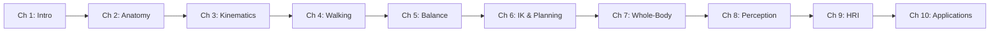

# Module 2: Humanoid Robotics

Welcome to Module 2! This module explores the fascinating world of **humanoid robots** - robots designed to mimic human form and function. You'll learn how to design, build, and program humanoid robots for real-world applications.

## What You'll Learn

By the end of this module, you will:

- ✅ Understand humanoid robot anatomy and design principles
- ✅ Master kinematics and dynamics of humanoid systems
- ✅ Implement bipedal walking and balance control
- ✅ Work with humanoid robot hardware and sensors
- ✅ Program complex human-like behaviors
- ✅ Apply machine learning for motion planning
- ✅ Deploy humanoid robots in real-world scenarios

## Module Structure

This module contains **10 chapters** organized into 3 sections:

### 🧬 Section 1: Fundamentals (Chapters 1-3)
- **Chapter 1**: Introduction to Humanoid Robotics
- **Chapter 2**: Humanoid Robot Anatomy and Design
- **Chapter 3**: Kinematics and Dynamics

### 🚶 Section 2: Motion and Control (Chapters 4-7)
- **Chapter 4**: Bipedal Walking Fundamentals
- **Chapter 5**: Balance and Stability Control
- **Chapter 6**: Inverse Kinematics and Motion Planning
- **Chapter 7**: Whole-Body Control

### 🤖 Section 3: Advanced Applications (Chapters 8-10)
- **Chapter 8**: Humanoid Perception and Sensing
- **Chapter 9**: Human-Robot Interaction
- **Chapter 10**: Real-World Applications and Case Studies

## Prerequisites

- Completion of Module 1 (ROS 2 basics)
- Linear algebra and calculus fundamentals
- Basic control theory knowledge
- Python programming proficiency

## Learning Path

## Hands-On Projects

1. **Kinematic Chain Solver**: Forward and inverse kinematics
2. **Walking Simulation**: Basic bipedal gait in simulation
3. **Balance Controller**: ZMP-based stability control
4. **Interactive Robot**: Gesture recognition and response

## Featured Platforms

- **NAO**: Educational humanoid robot
- **Pepper**: Social humanoid robot
- **Atlas**: Advanced research humanoid (Boston Dynamics)
- **TALOS**: Full-size humanoid research platform

Let's build humanoid robots! 🤖
